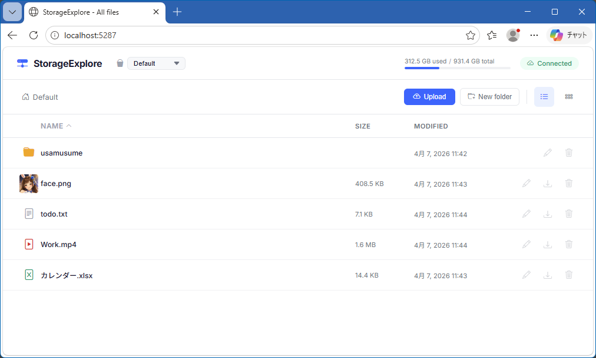

# StorageExplore

A simple browser-based file storage manager for browsing and managing files on a local disk.

## Features

- **File listing** — Browse files and folders with list or grid view
- **Upload** — Upload multiple files at once via drag & drop or file picker
- **Download** — Download files directly from the browser
- **Preview** — View images, videos, text, and other supported formats inline
- **Folder management** — Create, delete, and rename files and folders
- **Multiple buckets** — Define multiple storage locations in the config and switch between them
